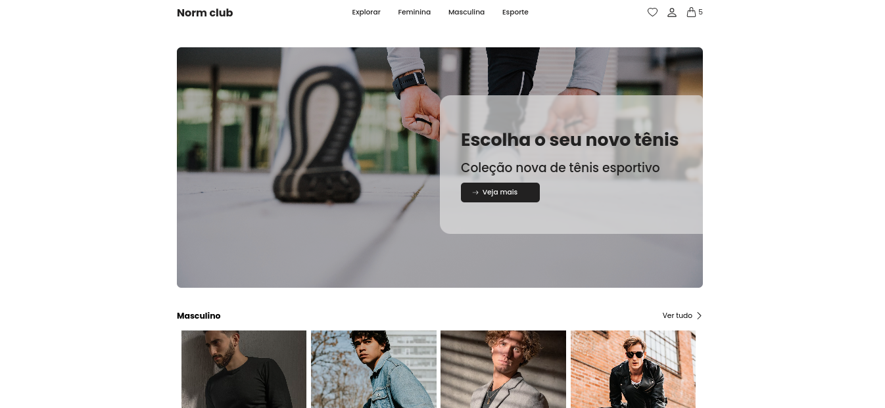

<h1 style="text-align: center; font-weight: bold;">Ecommerce</h1>

<div align="center" >
  
</div>

## Sobre o Projeto

A ideia dessa aplicação é termos um site onde podemos visualizar e comprar roupas, acessorios ou tênis. Nesse site vamos poder fazer login com email/senha ou com google, além disso podemos navegar entre as categorias expostas, favoritar o produto que mais lhe agrada, adicionar ao carrinho e simular sua compra. Nesse site estamos usando react para sua construção, react hook form para formulários, yup para validações e o firebase para armazenamento dos dados, utilizando os serviços de autenticação e firestore para banco de dados.

### Tecnologias Usadas

- [React](https://reactjs.org/)
- [React router](https://reactrouter.com/en/main)
- [React Hook Form](https://react-hook-form.com/get-started/#Handleerrors)
- [React icons](https://react-icons.github.io/react-icons)
- [Styled-components](https://styled-components.com/)
- [TypeScript](https://www.typescriptlang.org/)
- [Firebase](https://firebase.google.com/docs?gclsrc=ds&gclid=COSov8qRrf0CFUfEgQodpV4MfA&hl=pt-br)
- [Axios](https://axios-http.com/ptbr/docs/api_intro)
- [Yup](https://www.npmjs.com/package/yup)

### Como rodar a aplicação

```bash
# Clone este repositório
$ git clone https://github.com/kasilianaoliveira/ecommerce
# Acesse a pasta do projeto
$ cd ecommerce
# Instale as dependências
$ npm install
# ou
$ yarn
# Execute a aplicação em modo de desenvolvimento
$ yarn start
```
